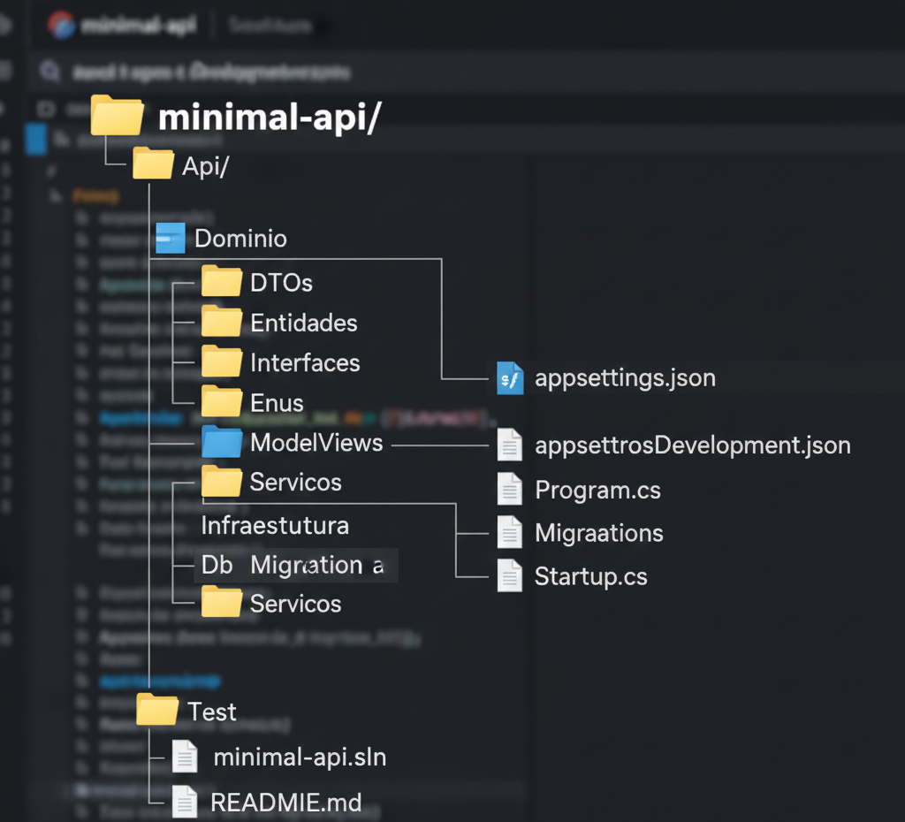

# 📘 Minimal API – DIO

Este repositório contém o projeto desenvolvido como parte do desafio da Digital Innovation One (DIO), focado na criação de uma Minimal API utilizando .NET 6/7+, seguindo boas práticas, organização por camadas e recursos modernos do ecossistema .NET.

O objetivo é demonstrar domínio de construção de APIs simples, performáticas e escaláveis, além de versionamento com Git e publicação no GitHub.

## 🚀 Tecnologias Utilizadas

.NET 6/7+

ASP.NET Core Minimal API

Entity Framework Core

SQLite / SQL Server (dependendo do seu projeto)

Swagger / OpenAPI

AutoMapper

Padronização REST

Injeção de Dependência

Camadas: API, Domínio, Infraestrutura

                 

## 📌 Funcionalidades Principais

✔️ CRUD completo (Create, Read, Update, Delete)
✔️ Persistência de dados com EF Core
✔️ Endpoints minimalistas
✔️ Configuração de Swagger (Documentação)
✔️ Camadas separadas para domínio, infraestrutura e API
✔️ Suporte a validações e regras de negócio
✔️ Padrão Repository/Service (se implementado)

### 🧪 Como Executar o Projeto
1️⃣ Restaurar dependências
dotnet restore

2️⃣ Entrar na pasta da API
cd Api

3️⃣ Criar o banco (se usar EF)
dotnet ef database update

4️⃣ Rodar o projeto
dotnet run

### API iniciará em:

👉 http://localhost:5004

👉 http://localhost:5004/swagger
 (Documentação)

### 📜 Endpoints Principais

Coloque aqui seus endpoints reais. Exemplo abaixo:

GET /api/produtos

Retorna todos os produtos cadastrados.

GET /api/produtos/{id}

Retorna um produto pelo ID.

POST /api/produtos

Cadastra um novo produto.

PUT /api/produtos/{id}

Atualiza um produto existente.

DELETE /api/produtos/{id}

Remove um produto.

(Se quiser, eu crio essa tabela certinha baseada no seu código real.)

## 📦 Banco de Dados

O projeto utiliza:

SQLite (arquivo .db)
ou

SQL Server (string no appsettings.json)

Dependendo do seu caso, você pode incluir no repo:

database.db

ou scripts SQL em:

docs/script.sql

## 🧰 Melhorias Implementadas

(Aqui você pode adicionar o que já mudou no código — posso preencher para você se quiser.)

Exemplos:

Código reorganizado em camadas

Nomeclatura corrigida

DTOs implementados

Documentação Swagger aprimorada

Tratamento de erros padronizado

Validações adicionadas

## 🌐 Como Consumir a API

Use qualquer ferramenta REST, como:

Thunder Client (VSCode)

Postman

Insomnia

Swagger integrado

## 📎 Documentação Adicional

Collection do Postman incluída em docs/MinimalApi.postman_collection.json

Diagrama de entidades (opcional)

Scripts de banco

## 📚 Aprendizados do Projeto

Durante o desenvolvimento, pude consolidar conhecimentos como:

Construção de APIs minimalistas com .NET

Organização de camadas em projetos reais

Versionamento com Git e GitHub

Uso de EF Core + Migrations

Documentação com Swagger

Estruturação profissional de repositórios
